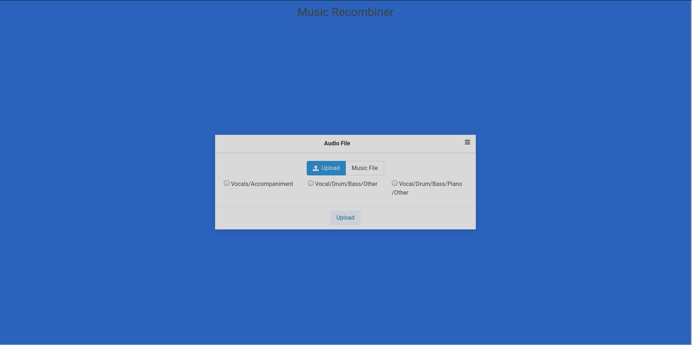
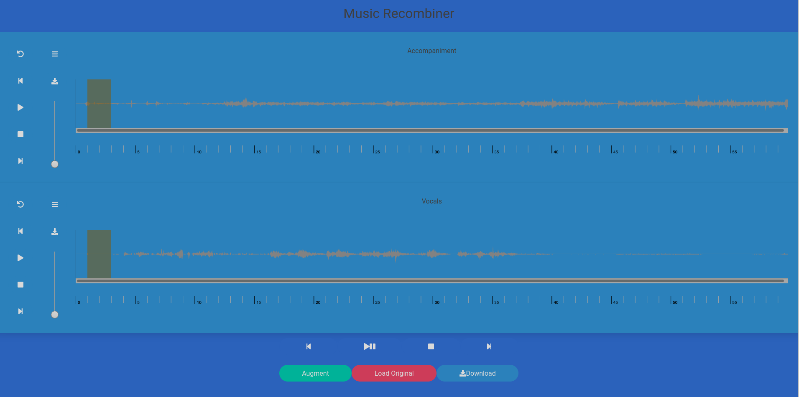
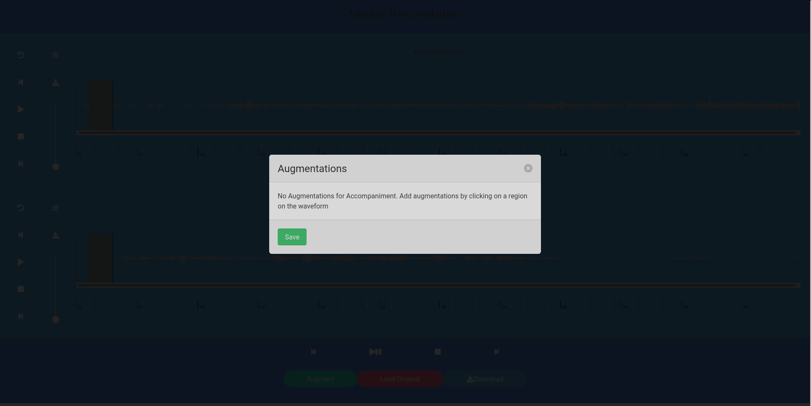
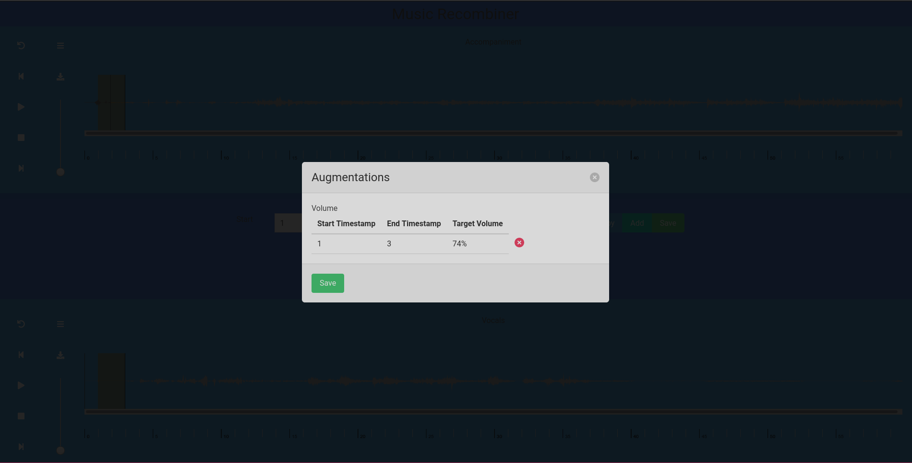

Music Recombiner separates input music file into different stems. User can then select which stem and which part of music to augment. End result is recombined and the overall effect is a modified music file by the user.

Work is still in progress.

## Working

1. User uploads an .mp3 file.
2. Music Separator separates music into different stems.
3. User can then edit parts of song according to defined commands.
4. Re-combine the music.

# Screenshot

